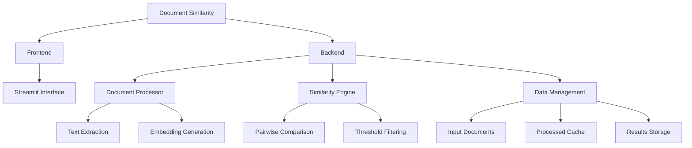
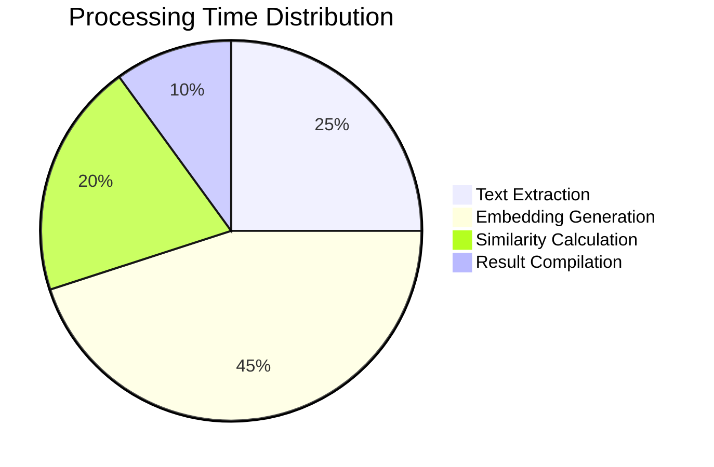
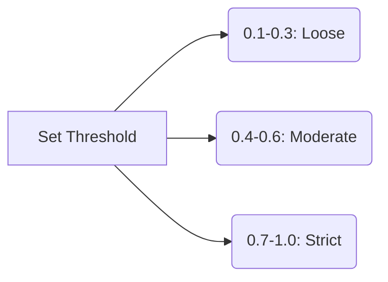

Here's a professional `README.md` file for your Document Similarity project with visual enhancements:

```markdown
# 📄 Document Similarity Analyzer


<div align="center">
  
[](https://streamlit.io/)
[](https://python.org)
[](https://huggingface.co/)
[](LICENSE)

</div>

## 🌟 Features

<div align="center">
  
| Feature | Description | Preview |
|---------|-------------|---------|
| **Multi-Format Support** | Process TXT, PDF, DOCX & MD files |  |
| **Smart Analysis** | NLP-powered similarity detection |  |
| **Interactive Visuals** | Explore data with beautiful charts |  |
| **Query Search** | Find similar content with natural language |  |

</div>

## 🚀 Quick Start

### Prerequisites
- Python 3.8+
- pip package manager

### Installation
```bash
# Clone the repository
git clone https://github.com/your-username/document-similarity.git
cd document-similarity

# Install dependencies
pip install -r requirements.txt
```

### Running the Application
```bash
cd frontend
streamlit run app.py
```

The application will automatically open in your browser at `http://localhost:8501`

## 🛠️ Project Structure



## 📊 Technology Stack

<div align="center">
  
| Component | Technology |
|-----------|------------|
| Frontend | Streamlit |
| Backend | Python 3.8+ |
| NLP Model | all-MiniLM-L6-v2 |
| Text Processing | PyPDF2, python-docx |
| Visualization | Plotly, Matplotlib |
| Data Management | Pandas, Joblib |

</div>

## 📈 Performance Metrics



## 📚 Usage Guide

### 1. Document Upload
- Supports batch upload of multiple files
- Automatic format detection
- File size validation (max 16MB)

### 2. Analysis Configuration


### 3. Results Interpretation
- Similarity scores range from 0 (no similarity) to 1 (identical)
- Color-coded results for easy scanning
- Export options for further analysis

## 🤝 Contributing

We welcome contributions! Please follow these steps:
1. Fork the project
2. Create your feature branch (`git checkout -b feature/AmazingFeature`)
3. Commit your changes (`git commit -m 'Add some amazing feature'`)
4. Push to the branch (`git push origin feature/AmazingFeature`)
5. Open a Pull Request

## 📜 License

Distributed under the MIT License. See `LICENSE` for more information.

## ✉️ Contact

Project Maintainer - [Your Name](mailto:your.email@example.com)

Project Link: [https://github.com/your-username/document-similarity](https://github.com/your-username/document-similarity)

---

<div align="center">
  


</div>
```

## 🎨 Visual Assets

For this README to work perfectly, you'll need to create these assets in a `/assets` folder:

1. **banner.gif** - An animated demo of your application
2. **upload-demo.gif** - Showing file upload process
3. **analysis-demo.gif** - Showing analysis in action
4. **viz-demo.gif** - Showing visualizations
5. **search-demo.gif** - Showing query search
6. **footer.png** - Optional decorative footer

You can create these GIFs using screen recording tools like:
- [ScreenToGif](https://www.screentogif.com/) (Windows)
- [Giphy Capture](https://giphy.com/apps/giphycapture) (Mac)
- [Peek](https://github.com/phw/peek) (Linux)

For the mermaid diagrams, they'll automatically render on GitHub and in most modern Markdown viewers.

Would you like me to provide specific content for any of the GIFs or suggest alternative visualization approaches?